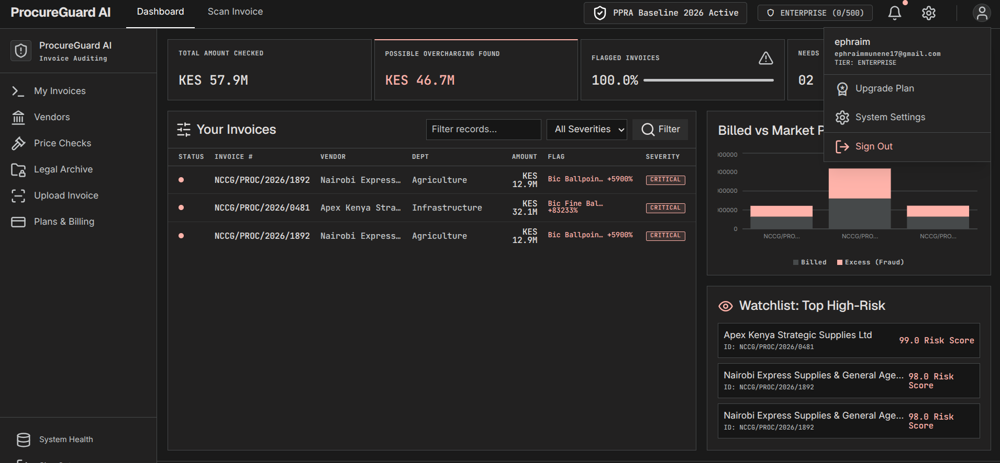

# ProcureGuardAI

A dashboard for monitoring public expenditure trends across county departments.

## Setup Instructions

### Prerequisites

- Node.js 24.x
- PostgreSQL database (Supabase)
- npm or yarn

### 1. Clone the repository

```bash
git clone https://github.com/Ephraim-Munene/ProcureGuardAI.git
cd procureguardai
```

### 2. Install dependencies

```bash
npm install
# Or: yarn install
```

### 3. Environment setup

Copy the example environment file:

```bash
cp .env.local .env
```

Configure the following variables:

```env
# Supabase
NEXT_PUBLIC_SUPABASE_URL=your_supabase_url
NEXT_PUBLIC_SUPABASE_ANON_KEY=your_supabase_anon_key

# Additional config
```

### 4. Database migration

```bash
npx prisma generate
npx prisma migrate deploy
```

### 5. Run the development server

```bash
npm run dev
# Or: yarn dev
```

The app will be available at `http://localhost:3000`.

## Project Structure

```
├── backend/      # Express + Node.js API
├── frontend/     # React + Tailwind CSS
├── tier/         # Additional tiers/configurations
└── .vercel/      # Vercel deployment config
```

## Features

- **Document Upload**: Support for various file formats
- **Price Data Visualization**: Recharts bar chart comparing Invoiced Unit Price vs. Estimated Fair Market Price
- **PostgreSQL Database**: Managed via Prisma ORM for users, invoices, line items, and audit scores
- **Audit Status Management**: Update invoice states (FLAGGED, UNDER_INVESTIGATION, RESOLVED)

## Screenshot



*Add your screenshot here (PNG format, ~800x600 recommended)*
